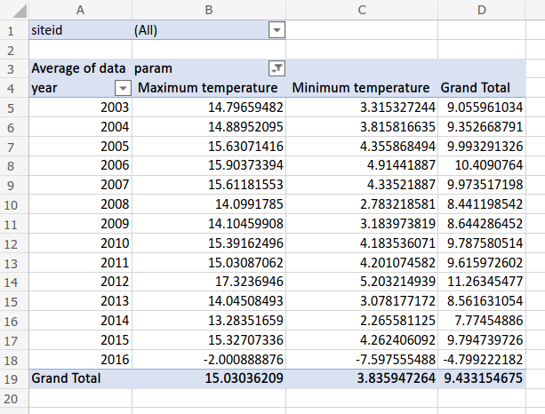

# Week 9 SGTA (External offering)

# Activities

## Activity 1 - Date formats (10 minutes)

Both Excel and MATLAB offer the option to convert datetime values to text, and read dates from text, using different formats. Review the following information about the different format patterns available in each language:

* Excel date formats
  * Documentation from Microsoft: https://support.microsoft.com/en-us/office/format-a-date-the-way-you-want-8e10019e-d5d8-47a1-ba95-db95123d273e
* MATLAB date formats
  * Documentation from MATLAB: https://www.mathworks.com/help/matlab/ref/datetime.html#buhzxmk-1-Format

Fill the following table. The first row has been filled for your convenience.

| Date | Format in Excel | Format in MATLAB |
|---|---|---|
| 9/04/2014 | d/mm/yyyy | d/MM/yyyy|
| 09/04/2014 | 
| April 9, 14 | 
| Apr 29, 2014 9:41 PM | 
| 08-Mar-2015 19:25 | 

## Activity 2 - Excel Dates (20 minutes)

The following CSV file contains weather data from the US (FYI, the original file is from https://figshare.com/articles/weather_data_csv/5012747).

* [weather_data.csv](weather_data.csv)

Complete the following tasks.

1. Import the CSV file into an Excel spreadsheet. *Note that this is a large file and it may take time to import the file*. Remember the steps:

   1. Upload the CSV file to OneDrive.
   2. Click on the file to open it in Excel Online.
   3. Convert the file to Excel format.
2. Create the columns `Day`, `Month`, `Year` and use EXCEL formulas (`DAY`, `MONTH`, `YEAR`) to populate the columns.
4. Create the column `US format` and use the EXCEL formula (`TEXT`) to generate dates in US format using the `Day`, `Month`, and `Year` columns. In the US format, the month is written before the day. For example, if the date is `23/11/2014`, in US format it will be `11/23/2014`.

You can find documentation about the TEXT function here:
* https://support.office.com/en-us/article/combine-text-with-a-date-or-time-cef6a66c-8176-470c-ba85-4b030405dfbf
* https://support.office.com/en-us/article/text-function-20d5ac4d-7b94-49fd-bb38-93d29371225c

## Participation task 1

Download and submit the excel file (.xlsx) with your solution to activity 2 to the week 9 SGTA participation task submission box.

Your participation will count as satisfactory if you can correctly fill some of the `Day`, `Month`, and `Year` columns, and you have made a reasonable attempt to correctly fill the `US format` column.

## Activity 3 - Excel pivot tables (20 minutes)

Perform the following tasks:

1. Upload the following CSV file into Excel Online. The file lists daily weather records for several weather stations.

    * [weather_data.csv](weather_data.csv)

2. Create an Excel pivot table that converts this long table into a wide table so that:

    * Each row shows the data for an entire year.
    * There is a column for the maximum temperature, and another for the minimum temperature.
    * Each cell in the pivot table shows the **average** values.

    To do this, we suggest that you follow these steps:

    1. Add a column that shows the **year** of the date. The easiest way to populate this column is to use Excel's YEAR formula.
    2. Create the pivot table.
    3. Drag the correct fields so that years are shown as rows, type of measure is shown as columns.
    4. Filter the columns so that they only show the maximum and minimum temperature

    The final pivot table should look like this:

    

    Answer the following questions:

    1. What is the average maximum temperature in year 2003?
    2. What is the average maximum temperature in year 2003 in **ACRE**?

Share the workbook with the other members of your group so that they can submit the participation activity.

Nominate one member of the group who will present the solution to the rest of the class.

## Participation task 2

Submit the Excel (.xlsx) file that shows the pivot table of activity 3.

# Optional activities

If you have time and want to do more, attempt these exercises.

## OPTIONAL Activity 4 - Excel: Processing Long Tables

Using the weather data that you have generated in activity 2, attempt to answer the following questions by using Excel formulas:

1. What is the average precipitation?
2. What is the average precipitation in Antigo?
3. What was the average precipitation in Antigo in March 2003?
4. Which site has had the highest temperature in March 2003? (hint: read https://www.extendoffice.com/documents/excel/2547-excel-find-highest-value-in-a-row-and-return-column-title.html)

## OPTIONAL Activity 5 - MATLAB dates

Repeat the same exercises of activity 2, but now using MATLAB.

