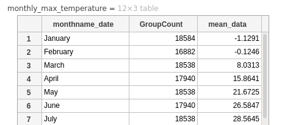
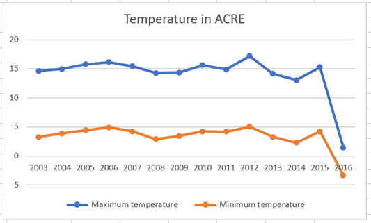
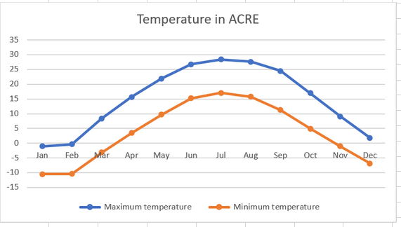
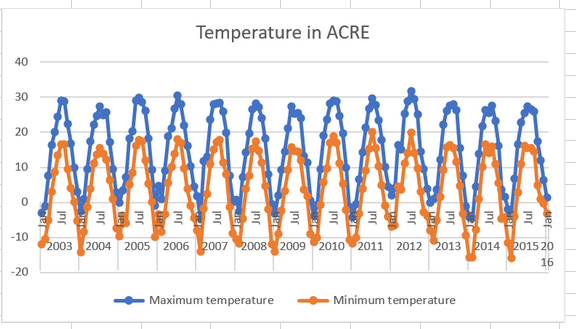
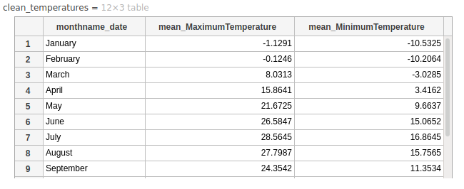

# Week 10 SGTA (Internal Offering)

# In-class test 3

During the SGTA you will be doing the third in-class test. The duration of the test is 45 minutes from the time you start the quiz. In any case, you must submit by the end of the SGTA session.
 
* Get the questions and submit your answers here: https://ilearn.mq.edu.au/mod/quiz/view.php?id=7048816 (only during the time scheduled for your SGTA session)

# Activities

## Activity 1 - MATLAB's Groupsummary (15 minutes + 10 minutes discussion)

You will be assigned to a group (or a breakout room if the class is online). As a group, perform the following tasks:


1. Upload the following CSV file into MATLAB Online.

   * [weather_data.csv](weather_data.csv)

2. Write a MATLAB live script that does the following:

    1. Import the contents of the file `weather_data.csv` and stores it in a variable with name `weather_data`. For this you can use the import data tool and generate the corresponding live script. You should not need to edit the defaults presented by the import data tool.

    2. Create a new table that contains only the rows that correspond to the maximum temperature. Store the table in the variable `maximum_temperature`.

    3. Using `groupsummary`, create a table that groups all values by month name. To do this, you must bin the `date` column using the option `monthname`. Store the resulting table in a variable with name `monthly_max_temperature`. The first rows of the table should look like this:

    

Share the livescript with the other members of your group so that they can submit the participation activity.

Nominate one member of the group who will present the solution to the rest of the class.

## Participation Task

Submit the MATLAB Live script (.mlx) file that shows the code for activity 1. After submission, show your result to your tutor so that your attendance can be recorded.


## Activity 2 - Pivot charts in Excel (15 minutes + 5 minutes discussion)

You will be assigned to a group (or a breakout room if the class is online). As a group, perform the following tasks:

1. Upload the CSV file [weather_data.csv](weather_data.csv) into Excel Online and re-create the pivot table of activity 3 of SGTA week 9. Here is the screenshot of how the pivot table should look:

 
- Using the pivot table you have just created and the appropriate filter, generate a pivot chart that shows a multi-line plot of the average maximum and minimum temperature of the site **ACRE**. The plot should look like this:



Share the Excel workbook with the other members of your group so that they can submit the participation activity.

Nominate one member of the group who will present the solution to the rest of the class.

# Optional Activities

## OPTIONAL Activity 3 - Years and Months (10 minutes + 10 minutes discussion)

Modify your pivot table from Activity 1 so that the chart shows the monthly averages with these two variants:

1. Month of the year, regardless of the year:



2. Month of the year and the year:




## OPTIONAL Activity 4 - MATLAB's `unstack` and `groupsummary`  (15 minutes + 10 minutes discussion)

Extend the live script that you wrote for Activity 1 so that it uses `unstack` and `groupsummary` in order to produce this table:



The following template is a guide of how you could achieve this:

```matlab
% remove the column "VarName1"
clean_table = removevars(weather_data, ...) 
% create a wide table based on the "param" column
wide_table = unstack(clean_table, ...) 
% Compute the average temperature per month
temperatures = groupsummary(wide_table, ...) 
% remove the appropriate columns
clean_temperatures = removevars(temperatures, ...) 
```

*Hint: You can specify a list of variables this way: `["MaximumTemperature" "MinimumTemperature"]`*

## OPTIONAL Activity 5 - Correlation matrix (15 minutes + 10 minutes discussion)

The following CSV file has been downloaded from https://people.sc.fsu.edu/~jburkardt/data/csv/csv.html and contains 1034 records with various information from baseball players.

* [mlb_players.csv](mlb_players.csv)

Using MATLAB, write a live script that implements the following:

1. Load the CSV file mlb_players.csv.
2. Compute the correlation matrix between the columns "Heightinches" and "Weightlbs". To compute the correlation matrix, use MATLAB's `corrcoef` function. Remember that this function needs a matrix as input, so you need to extract the columns from your table using the notation `{ ... }`.
